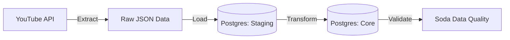

# YouTube API Data Engineering Project 🚀

A robust, containerized **Extract, Load, Transform (ELT)** pipeline designed to automate the collection and analysis of YouTube channel statistics. This project demonstrates modern data engineering practices using **Apache Airflow**, **PostgreSQL**, and **Docker**.

---

## 📖 Overview

This project automatically fetches video statistics (views, likes, comments, duration) for a specified YouTube channel and builds a data warehouse for historical analysis. It is designed to be **scalable**, **schedulable**, and **reliable** with built-in data quality checks.

**Key Features:**
- **Automated Ingestion**: extract data daily from the YouTube Data API v3.
- **Data Warehousing**: Structured **Staging** and **Core** layers in PostgreSQL.
- **Data Quality**: Automated validation using **Soda Core** to ensure data integrity.
- **Orchestration**: Fully managed workflows with **Apache Airflow**.
- **Infrastructure as Code**: Entire stack deployable via **Docker Compose**.

---

## 🏗️ Architecture

The pipeline follows a modern ELT pattern:

1.  **Extract (API)**: Python scripts fetch playlist and video data from YouTube.
2.  **Load (JSON)**: Raw data is saved as JSON for auditability and recovery.
3.  **Staging (Postgres)**: Data is successfully loaded into a staging table (`staging.yt_api`).
4.  **Transform (Postgres)**: Data is cleaned, transformed, and upserted into the core table (`core.yt_api`).
5.  **Validate (Soda)**: Quality checks run against both schemas to catch anomalies.



---

## 🛠️ Technologies Used

-   **Language**: Python 3.9+
-   **Orchestration**: Apache Airflow 2.9.2
-   **Database**: PostgreSQL 13 (Metadata & Data Warehouse)
-   **Containerization**: Docker & Docker Compose
-   **Data Quality**: Soda Core
-   **API**: YouTube Data API v3

---

## 🚀 Getting Started

### Prerequisites

-   [Docker Desktop](https://www.docker.com/products/docker-desktop) installed and running.
-   A [Google Cloud Project](https://console.cloud.google.com/) with **YouTube Data API v3** enabled.
-   An API Key from Google Cloud.

### Installation

1.  **Clone the repository**:
    ```bash
    git clone https://github.com/yourusername/youtube_API_pet_project.git
    cd youtube_API_pet_project
    ```

2.  **Configure Environment**:
    Create a `.env` file in the root directory (based on provided templates or requirements) containing your secrets:
    ```env
    AIRFLOW_UID=50000
    API_KEY=your_google_api_key_here
    CHANNEL_HANDLE=@YourTargetChannelHandle
    
    # Database Credentials
    POSTGRES_CONN_USER=airflow
    POSTGRES_CONN_PASSWORD=airflow
    # ... other Airflow/DB configs
    ```

3.  **Start the Infrastructure**:
    Run the following command to build and start all services (Airflow Webserver, Scheduler, Worker, Postgres, Redis):
    ```bash
    docker-compose up -d
    ```

4.  **Access Airflow**:
    -   Open your browser and go to `http://localhost:8080`.
    -   Login with the default credentials (usually `airflow`/`airflow` if not changed).
    -   Trigger the DAGs manually or wait for the schedule.

---

## 🔄 Workflows (DAGs)

The project consists of three main DAGs:

1.  **`produce_json`**:
    -   Orchestrates the extraction of data.
    -   Connects to YouTube API and saves the daily snapshot to `./data/`.
    
2.  **`update_db`**:
    -   Reads the daily JSON snapshot.
    -   Updates the **Staging** table (Sync/Upsert).
    -   Propagates changes to the **Core** table with transformations.

3.  **`data_quality`**:
    -   Runs Soda checks to verify schema validity, row counts, and missing values.

---

## 🧪 Testing

Integration tests are available to ensure the pipeline components work as expected.
```bash
# Run tests using pytest
pytest tests/
```

---

## 📂 Project Structure

```
├── dags/                 # Airflow DAGs and Task definitions
│   ├── api/              # YouTube API interaction logic
│   ├── datawarehouse/    # SQL & Database operations
│   └── data_quality/     # Soda quality check configurations
├── data/                 # Local storage for raw JSON files
├── docker/               # Container initialization scripts
├── tests/                # Integration tests
├── docker-compose.yaml   # Infrastructure definition
└── requirements.txt      # Python dependencies
```